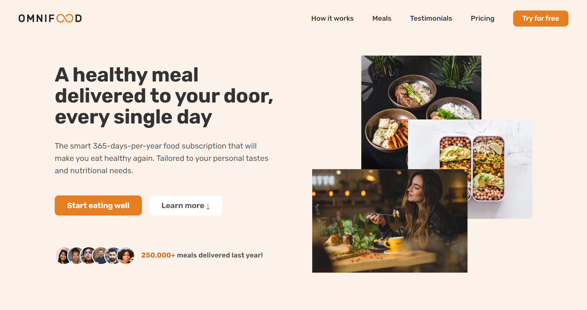

# Omnifood
Omnifood is a fully-responsive fictional startup that uses AI to recommend meal plans. \
The live demo of the application can be accessible [here](https://av2001.github.io/omnifood/). \
 

 

## Technologies Used ⚒️
+ HTML
+ CSS
+ JavaScript

## What Have I Learned? 🤔
+ Responsive Web Design
+ Smooth Scrolling
+ UI/UX Principles

## Contact Me 📞
If you would like to reach out to me, please do so on LinkedIn.
 
 

